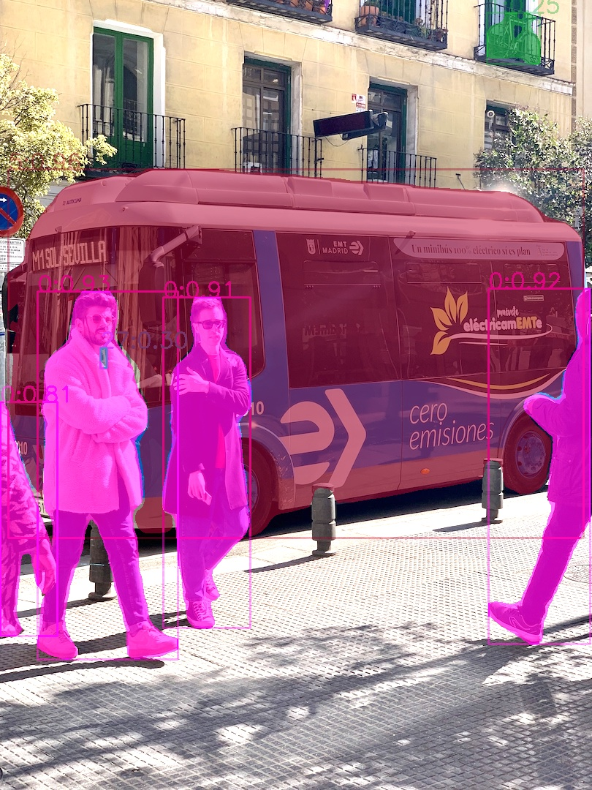
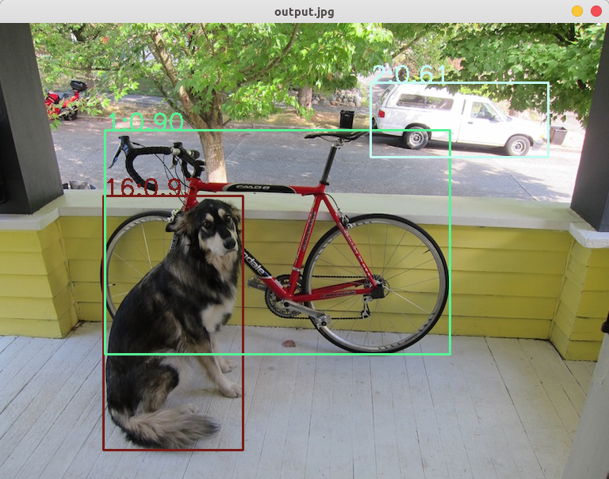

# Yolov8-instance-seg-tensorrt
based on the yolov8，provide pt-onnx-tensorrt transcode and infer code by c++

mkdir build  
cd build  
cmake ..  
make  
sudo ./onnx2trt ../models/yolov8n-seg.onnx ../models/yolov8n-seg.engine  
sudo ./trt_infer ../models/yolov8n-seg.onnx ../images/bus.jpg  



# 环境依赖

Nvidia Driver
CUDA：
CUDNN：
TensorRT： 

```shell
ruoxi@ruoxi:~/Downloads/Yolov8-instance-seg-tensorrt/build$ ./onnx2trt ../models/yolov8n-seg.onnx ../models/yolov8n-seg.engine 
[01/31/2023-23:58:09] [W] [TRT] onnx2trt_utils.cpp:364: Your ONNX model has been generated with INT64 weights, while TensorRT does not natively support INT64. Attempting to cast down to INT32.
successfully load the onnx model
[01/31/2023-23:58:10] [W] [TRT] Detected invalid timing cache, setup a local cache instead

successfully generate the trt engine model
```

```shell
ruoxi@ruoxi:~/Downloads/Yolov8-instance-seg-tensorrt/build$ ./trt_infer 
load engine success
宽高：810 1080
推理时间：327ms
后处理时间：11ms
sh: 1: pause: not found
```

- 错误操作
  
需要进入build路径下，再执行
```shell
./trt_infer: error while loading shared libraries: libnvinfer.so.6: cannot open shared object file: No such file or directory
ruoxi@ruoxi:~/Downloads/Yolov8-instance-seg-tensorrt$ cd build/
```

输入参数路径问题
```shell
ruoxi@ruoxi:~/Downloads/Yolov8-instance-seg-tensorrt/build$ ./onnx2trt 
Could not open file ../../models/yolov8n-seg.onnx
Could not open file ../../models/yolov8n-seg.onnx
[01/31/2023-23:55:14] [E] [TRT] ModelImporter.cpp:682: Failed to parse ONNX model from file: ../../models/yolov8n-seg.onnx
successfully load the onnx model
[01/31/2023-23:55:14] [E] [TRT] 4: [network.cpp::validate::2411] Error Code 4: Internal Error (Network must have at least one output)
Segmentation fault (core dumped)
```

```shell
ruoxi@ruoxi:~/Downloads/Yolov8-instance-seg-tensorrt$ ./trt_infer 
./trt_infer: error while loading shared libraries: libnvinfer.so.6: cannot open shared object file: No such file or directory
ruoxi@ruoxi:~/Downloads/Yolov8-instance-seg-tensorrt$ cd build/
ruoxi@ruoxi:~/Downloads/Yolov8-instance-seg-tensorrt/build$ ./onnx2trt 
[02/01/2023-00:13:06] [W] [TRT] onnx2trt_utils.cpp:364: Your ONNX model has been generated with INT64 weights, while TensorRT does not natively support INT64. Attempting to cast down to INT32.
successfully load the onnx model
[02/01/2023-00:13:06] [W] [TRT] Detected invalid timing cache, setup a local cache instead
^C
ruoxi@ruoxi:~/Downloads/Yolov8-instance-seg-tensorrt/build$ ./trt_infer 
load engine success
宽高：810 1080
推理时间：327ms
后处理时间：11ms
sh: 1: pause: not found
ruoxi@ruoxi:~/Downloads/Yolov8-instance-seg-tensorrt/build$ ./onnx2trt ../models/yolov8s-seg.onnx ../models/yolov8s-seg.engine
[02/01/2023-00:20:07] [W] [TRT] onnx2trt_utils.cpp:364: Your ONNX model has been generated with INT64 weights, while TensorRT does not natively support INT64. Attempting to cast down to INT32.
successfully load the onnx model
[02/01/2023-00:20:08] [W] [TRT] Detected invalid timing cache, setup a local cache instead
successfully generate the trt engine model
ruoxi@ruoxi:~/Downloads/Yolov8-instance-seg-tensorrt/build$ ./trt_infer ../models/yolov8s-seg.engine ../images/bus.jpg
load engine success
宽高：810 1080
推理时间：353ms
后处理时间：20ms
sh: 1: pause: not found
ruoxi@ruoxi:~/Downloads/Yolov8-instance-seg-tensorrt/build$ 
```


```shell
ruoxi@ruoxi:~/Workspace/Yolo_TensorRT_Sample/Yolov8-instance-seg-tensorrt/build$ ./trt_infer_det ../models/yolov8n.trt ../images/dog.jpg 
load engine suceess

file: ../models/yolov8n.trt
size is:  27132021
宽高810 1080
推理时间：331ms
debug3
debug4
后处理时间：7ms
sh: 1: pause: not found
```




```shell
ruoxi@ruoxi:~/Workspace/Yolo_TensorRT_Sample/Yolov8-instance-seg-tensorrt/build$ ./trt_infer_seg ../models/yolov8n-seg.engine ../images/dog.jpg 
load engine success
宽高：768 576
推理时间：331ms
后处理时间：12ms
sh: 1: pause: not found
```